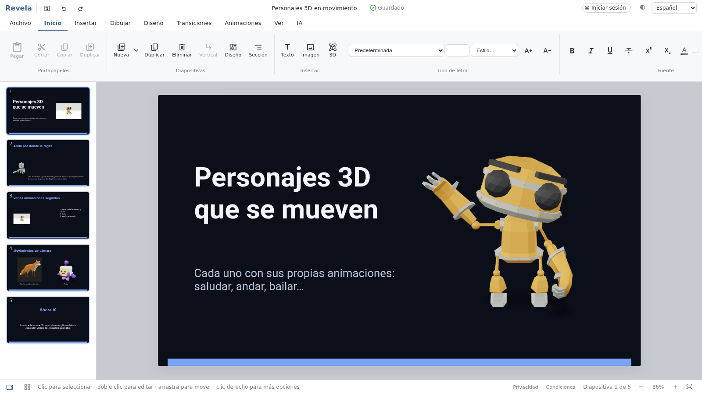

<div align="center">

# Revela

**Editor visual de presentaciones interactivas con 3D en vivo, construido sobre
[reveal.js](https://revealjs.com/).**

[English](README.md) · [Español](README.es.md) · [Web oficial](https://revelaslides.com) · [Demo](https://fmesasc.github.io/revela/) · [App de escritorio](https://github.com/fmesasc/revela/releases/latest) · [Hoja de ruta](ROADMAP.md)

</div>



Revela es un editor de presentaciones que funciona en el navegador. Combina una
experiencia de edición similar a una suite ofimática con una función que ninguna
suite nativa de Linux ofrece: **modelos 3D en vivo** incrustados en las
diapositivas. Las presentaciones se crean visualmente y se renderizan con
reveal.js, de modo que el resultado es una página web estándar y autónoma.

## Funciones

- **Editor completo tipo ofimática** (Archivo, Inicio, Insertar, Dibujar,
  Diseño, Transiciones, Animaciones, Ver, IA): texto con formato, listas
  anidadas, estilos, columnas, WordArt, diagramas tipo SmartArt (15 diseños que
  se escriben como un esquema, editables en PowerPoint), más de 70 formas (con texto dentro,
  botones de acción, forma libre) y combinar formas, tablas con celdas
  combinadas, estilos y fórmulas (=SUMA(ARRIBA)…), gráficos (varias series,
  combinados, apilados, 100 %, histograma, cascada, embudo, rectángulos,
  burbujas, mapas; desde tabla o CSV en vivo),
  iconos, ecuaciones, código, **modelos 3D**, vídeo, PDF y archivos adjuntos,
  tabulaciones, fuentes propias y dictado por voz.
- **Buscar comandos** (Ctrl+K, Alt+Q o «/»): escribe lo que quieres («código»,
  «imagen 3D», «pie de página»…) en cualquier idioma y se ejecuta; enseña
  dónde está en la cinta.
- **Copiar, cortar y pegar** (Ctrl+C/X/V, cinta y menú contextual; también
  con pulsación larga en el móvil), deshacer/rehacer, alineación con guías y
  espaciado inteligente, agrupar, bloquear, panel de selección (ocultar,
  renombrar, reordenar), copiar formato de cualquier objeto y orden de lectura.
- **Diseño:** paletas y fuentes del tema, editor del tema (fondo, texto, seis
  acentos y dos fuentes, con vista previa; la IA lo propone a partir de una
  descripción y no se aplica hasta que lo apruebas), kit de marca (colores, fuentes y
  logotipos), cambiar tamaño recolocando el contenido (A4, cuadrado, 9:16…),
  patrón de diapositivas, marcadores de posición, galería de plantillas e
  ideas de diseño.
- **Objetos:** formas con degradado o a mano alzada, vínculos en cualquier
  objeto, conectores rectos, en ángulo o curvos, texto curvo, texto
  alrededor de una imagen, imágenes dentro de un móvil, portátil o navegador,
  cuenta atrás, sonido de fondo que sigue al cambiar de diapositiva, y
  personajes 3D que andan por un recorrido y saludan sin cortarse.
- **Todo lo de reveal.js:** diapositivas verticales, fondos de vídeo, web,
  mosaico y parallax, todos los efectos de fragmento y temas, vista de
  desplazamiento, zoom y búsqueda, código paso a paso con desplazamiento
  automático, ajustar texto al cuadro e importar Markdown.
- **Animaciones y transiciones:** entrada, énfasis, salida, trayectorias
  dibujadas a mano, varias por objeto, «Dibujar» (la tinta se traza sola),
  disparadores, «después de la anterior», sonidos, Morph y 22 transiciones.
- **Presentar:** vista del orador, mando desde el móvil (QR), lápiz y
  resaltador, láser, subtítulos en directo, ensayar intervalos y grabar.
- **Votaciones en directo con QR**, **concursos con puntos y clasificación**
  (una lista o una carrera animada) y **preguntas del público**: el público
  responde desde el móvil (también dibujando, con una foto o con su voz) y los
  resultados se actualizan al instante.
- **Datos en vivo:** paneles de Power BI, Looker Studio, Tableau, Google
  Sheets, Grafana… y gráficos enlazados a un CSV.
- **IA con OpenRouter** (tu cuenta): crear presentaciones completas desde un
  tema, documentos o fotos (de apuntes, de una pizarra), asistente que edita
  la presentación y lee lo que le adjuntas (fotos, PDF, textos; pregunta si
  algo no está claro), mejorar diapositivas, notas, traducir, texto
  alternativo e imágenes.
- **Importar y exportar:** PowerPoint (.pptx) y OpenDocument (.odp) en ambos
  sentidos, HTML autónomo (funciona sin conexión), PDF (generado directamente),
  documentos y notas, imágenes, vídeo MP4/GIF, y Google Drive, OneDrive y
  Dropbox; todo desde la página Archivo (Nuevo, Abrir, Guardar, Compartir,
  Exportar, Imprimir, Proteger).
- **Recursos libres** en un panel lateral: imágenes (con filtros y fondo
  transparente), iconos, GIF, vídeos, sonidos y música, stickers y modelos 3D
  (Openverse, Iconify, Wikimedia Commons, Poly Haven, NASA, Sketchfab).
- **Colaboración:** coedición en directo con chat y enlaces para ver,
  comentar o editar, comentarios (también con PowerPoint y LibreOffice) con
  tareas asignadas a personas (con fecha límite), control de cambios,
  historial de versiones, firmas digitales, proteger con contraseña y marcar
  como final. En la edición oficial y la app de escritorio, presentaciones
  guardadas en la nube de Revela y compartidas con personas o por enlace
  (presentar, ver, comentar o editar), y videollamadas (Pro).
- **Accesibilidad e idiomas:** comprobador, texto alternativo, lector de
  pantalla; 11 idiomas, incluida interfaz de derecha a izquierda.
- **Apariencia del editor:** clara, oscura, automática o con tus colores.
- **Funciona sin conexión** (aplicación instalable), en móvil y con
  complementos y macros mediante una API.

Consulta la [hoja de ruta](ROADMAP.md) para el detalle y lo que viene después.

## Puesta en marcha

**App de escritorio** (Windows, macOS, Linux): instaladores en la [última versión](https://github.com/fmesasc/revela/releases/latest), que se genera con cada versión publicada (todas se conservan, con su número) (aún sin firmar: Windows y macOS avisan la primera vez). Una vez instalada se actualiza sola: al abrirla ofrece la versión nueva, comprobada con la clave de actualizaciones de Revela.

La aplicación son archivos estáticos, sin compilación.

```bash
git clone https://github.com/fmesasc/revela.git
cd revela
npm start            # = python3 -m http.server 8000; abre http://localhost:8000
npm test             # todos los tests (python3, Node.js 22+ y Chrome/Chromium)
```

Sirve con cualquier servidor estático; es preferible a abrir `index.html`
directamente para que el navegador cargue bien los módulos ES. Para usar la
aplicación no hay que instalar nada; los tests necesitan Node.js 22 o posterior.

## API, complementos y macros

El editor expone `window.Revela` (ver `src/api/index.js`): leer la presentación,
añadir diapositivas y objetos, modificarlos (un paso de deshacer cada vez),
escuchar cambios, exportar y añadir botones a la cinta. **Ver › Complementos**
carga un módulo ES por URL que exporta `default function (Revela)`;
**Ver › Macros** ejecuta fragmentos guardados con `Revela` disponible. Ambos se
guardan solo en tu navegador.
La guía completa, la referencia de la API y tres ejemplos que funcionan están en
[docs/COMPLEMENTOS.md](docs/COMPLEMENTOS.md) y [examples/complementos/](examples/complementos/).

```js
// mi-complemento.js
export default Revela => Revela.ui.addButton({
  id: 'agenda', label: 'Agenda', icon: 'list',
  onClick: R => {
    R.slides.add();
    R.add.text('<b>Agenda</b>', { x: 90, y: 60, w: 1100, h: 90 });
  },
});
```

## Arquitectura

Módulos ES estándar, sin framework ni empaquetador. La aplicación funciona por
sí sola en el navegador; la edición oficial añade el servidor de Revela
(`server/cloudflare`, un Worker de Cloudflare) para cuentas, documentos en la
nube, compartir y salas de coedición, que lo comprueba todo por sí mismo. Un
store central mantiene el documento y el estado de la interfaz y avisa a las
vistas en cada cambio. El código está organizado en capas, y cada una importa
solo de las inferiores (lo comprueban los tests):

```
src/
  apps/      puntos de entrada: editor, mando del móvil, página de votación, visor
  ui/        estructura, lienzo, cinta, diálogos, paneles, estilos
  api/       window.Revela para complementos y macros
  io/        formatos (reveal.js, PowerPoint, OpenDocument, Markdown), exportación, nube
  features/  operaciones sobre el documento por dominio: documento, diseño, animación, IA, colaboración, en directo, contenido
  render/    dibujo a SVG · i18n/  idiomas de la interfaz
  core/      modelo, store con deshacer/rehacer, persistencia, librerías del CDN
```

Más detalles en [docs/ARCHITECTURE.md](docs/ARCHITECTURE.md).

## Ediciones y web oficial

El mismo código se publica de tres formas, sin proyectos duplicados
(`tools/build-site.mjs` copia archivos; no se compila nada):

- **Edición abierta** — [fmesasc.github.io/revela](https://fmesasc.github.io/revela/): solo la aplicación
  (`npm run build:open`), gratis, con IA mediante tu propia clave de OpenRouter.
- **Web oficial** — [revelaslides.com](https://revelaslides.com): sus propias páginas (portada, precios,
  soporte; en un repositorio privado, no en este) y la aplicación en `/app/`, montadas con `node tools/build-site.mjs` (Cloudflare Pages). Allí la
  aplicación va marcada como edición oficial; las funciones de pago dependen de su servidor, que comprueba
  por sí mismo cuentas, planes y créditos (los secretos nunca van en este repositorio).
- **App de escritorio** — la misma aplicación en Tauri (`npm run build:desktop`), que usa el servidor
  oficial para las cuentas.

No se publica nada si no pasan todos los tests (GitHub Actions).

## Marca

El código tiene licencia MIT, pero el nombre **Revela**, su logotipo y el dominio **revelaslides.com**
identifican el proyecto oficial. Las copias y derivados son bienvenidos con otro nombre; por favor, no los
presentes como el Revela oficial.

## Contribuir

Las aportaciones son bienvenidas. Lee [CONTRIBUTING.md](CONTRIBUTING.md).

## Contribuciones

Si este proyecto te ha sido útil y te gustaría ver más proyectos similares, considera invitarme a un café :) para ayudarme a continuar desarrollando y mejorando el código. ¡Tu apoyo es muy apreciado y ayuda a mantener vivo este proyecto!

[](https://paypal.me/fmesasc)

## Licencia

[MIT](LICENSE) © Francisco Mesas Cervilla.

Los iconos integrados de `src/render/icons.js` proceden de [Lucide](https://lucide.dev) (licencia ISC; algunos derivan de Feather, MIT); sus avisos están en ese archivo.
